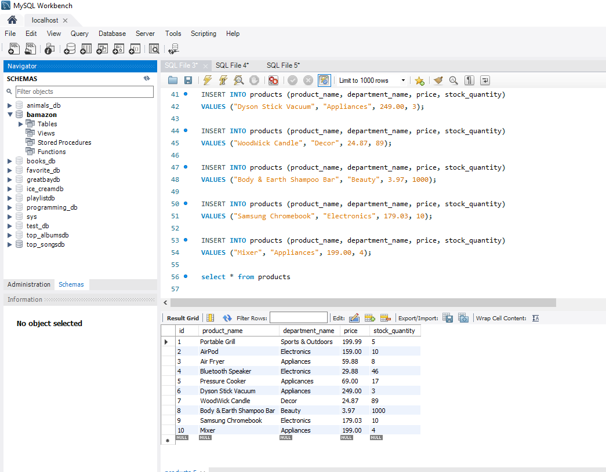
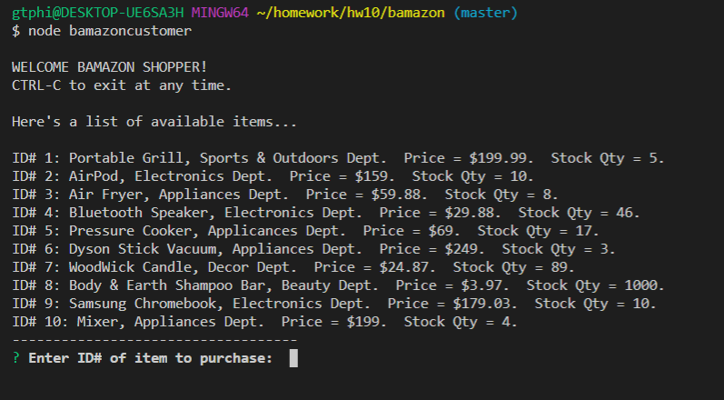
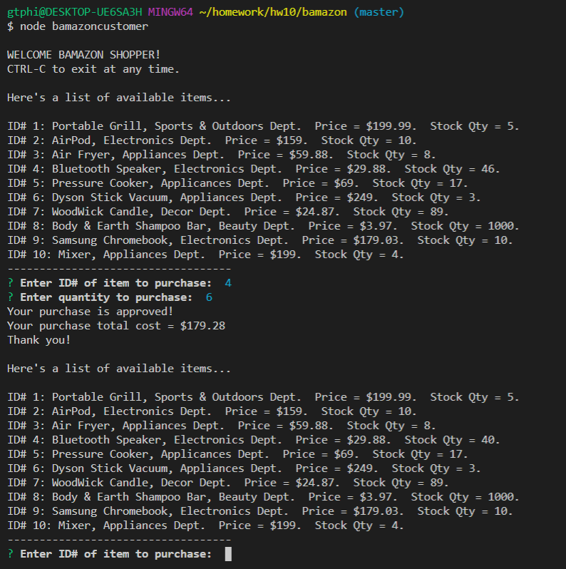
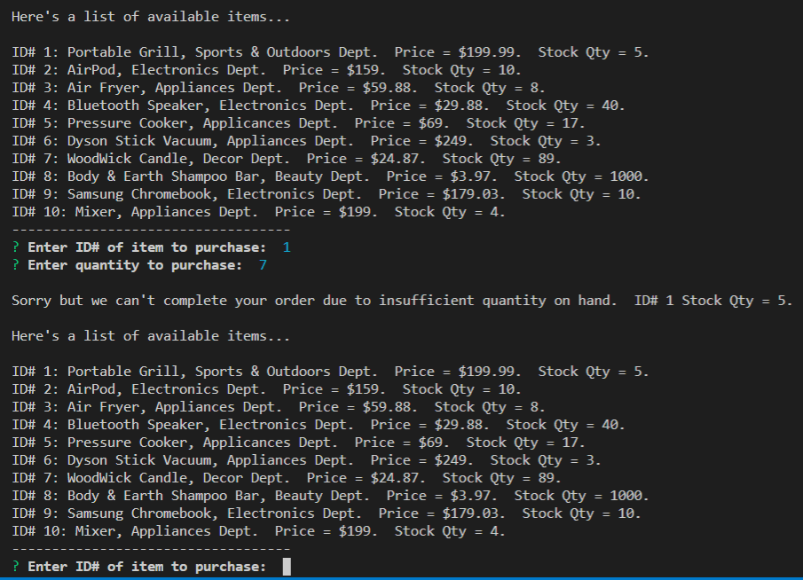
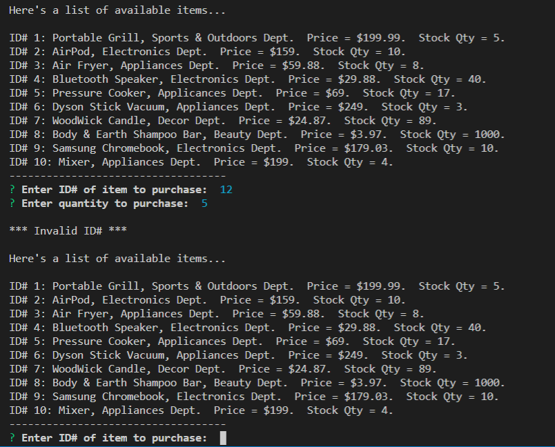
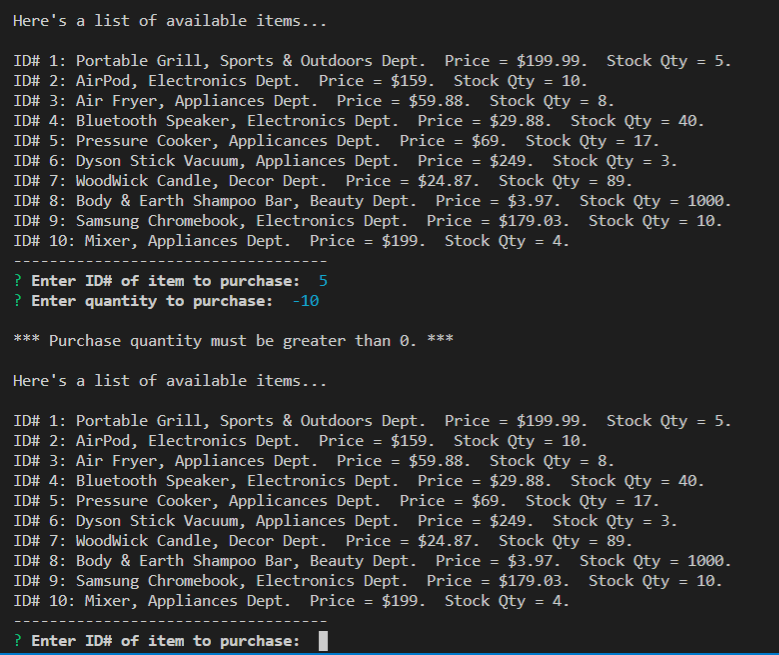
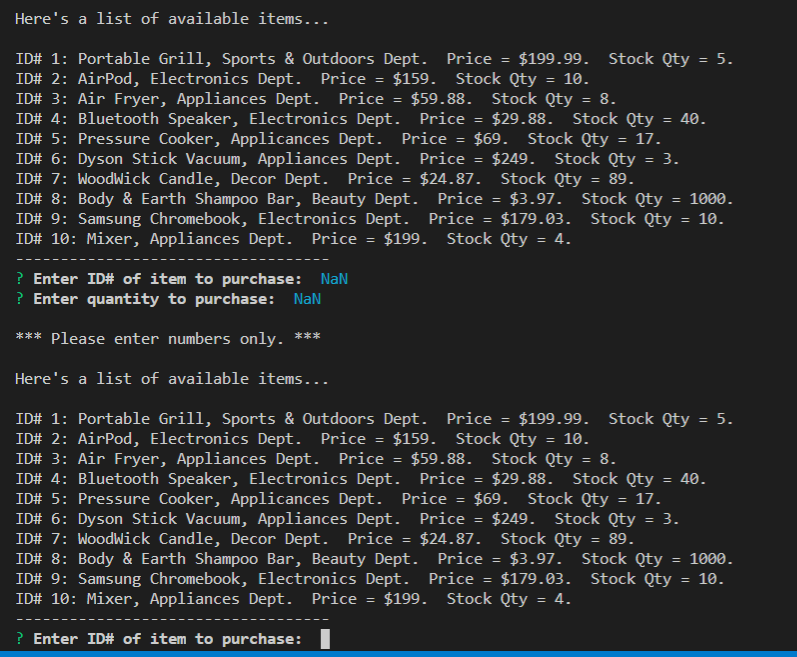

# bamazoncustomer

### Overview
bamazoncustomer is an Amazon-like storefront that utilizes MySQL. The app takes in orders from customers and depletes stock from the store's inventory.

### Setup
1. Clone the repo.
2. In Terminal window, enter "npm install".
3. Set up the bamazon database by running the SQL in bamazonDB.sql.
4. In Terminal window, enter "npm bamazoncustomer.js" to run the application.

### User Guide / Commands
The app is simple and self-explanatory.  Just follow the prompts.  CTRL-C to exit.

### Screen Shots

Screen shots showing execution of bamazoncustomer.js:

1.  initial setup of SQL database:

    

2.  initial products list:

    

3.  successful purchase:

    

4.  purchase attempt with insufficient stock:

    
    
5.  purchase attempt with invalid product ID#:

    

6.  purchase attempt with negative qty:

    

7.  purchase attempt with text entered:

    

## Author
Philip Hu
